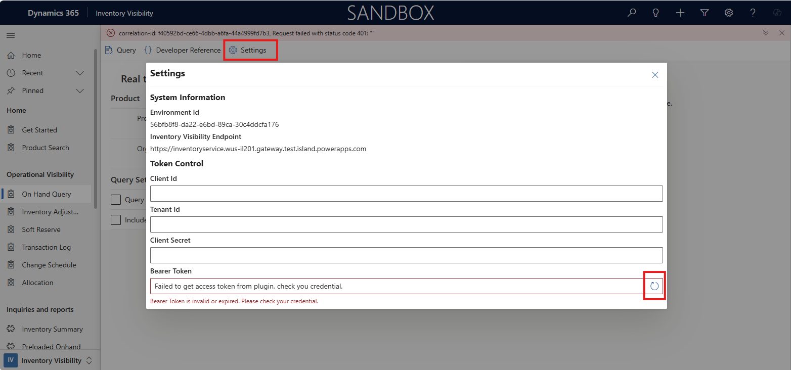

# 401 unauthorized invalid token issue

This page will provide the guide to fix the known issues that you get 401 unauthorized error when you post request to Inventory Visiblity.
401 error which means that your request is unauthorized, it always is caused by that you don’t use correct bearer token or the token has expired when you send this request.

## Get 401 unauthorized error in Inventory Visiblity PowerApps

**Error massage example：**

- Get 401 unauthorized error when you post request in Inventory Visiblity PowerApps

**Solution：**

1. Select the **Setting Icon** from the top navigation bar, it will pop up a window to show your credential info and current bearer token used in your request.
1. You will find there is a warning message under the **Bearer Token** row, it shows that "Bearer Token is invalid or expired.". Click the **Refresh** button to get a new token.
1. If you get new token successfully, go back to the **Operational Visibility Page** to query onhand again, to check whether the issue has been resolved.
1. If you cannot get a new token after you click the **Refresh** button, please check the your credential you used and check the environment Id shown in the setting page. Here are two cases:

    - If you find the environment Id is not the correct one, please contact the Inventory Visibility product team at [inventvisibilitysupp@microsoft.com](mailto:inventvisibilitysupp@microsoft.com).
    - If the environment Id is correct one, and your credential is correct, but you still cannot get valid bearer token, it most likely that your applicationId is not bind to this environment. Please uninstall the Inventory visiblity add-in from the [Lifecycle Services](https://lcs.dynamics.com/Logon/Index) page and try again to reinstall the **Inventory Visibility** add-in with your credential.

## Get 401 unauthorized error in Postman

**Error massage example：**

- Get 401 unauthorized error when you post request in Postman

**Solution：**

1. Follow the [Inventory Visiblity Authentication](https://learn.microsoft.com/en-us/dynamics365/supply-chain/inventory/inventory-visibility-api#inventory-visibility-authentication) to get a valid bearer token from Postman.
1. Select the Authorization tab, enter the valid bearer token you get from the step 1.
1. Go back to send request to Inventory visiblity again to check whether the issue has been resolved.
