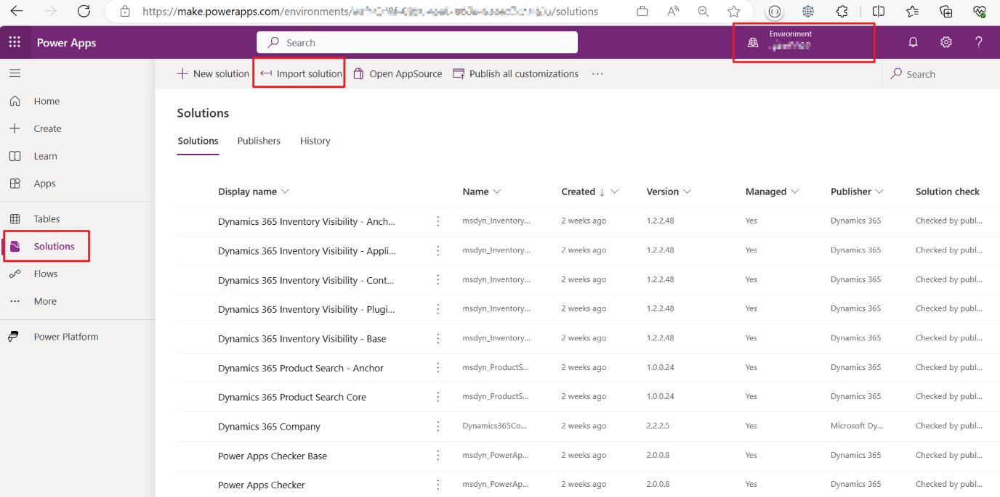
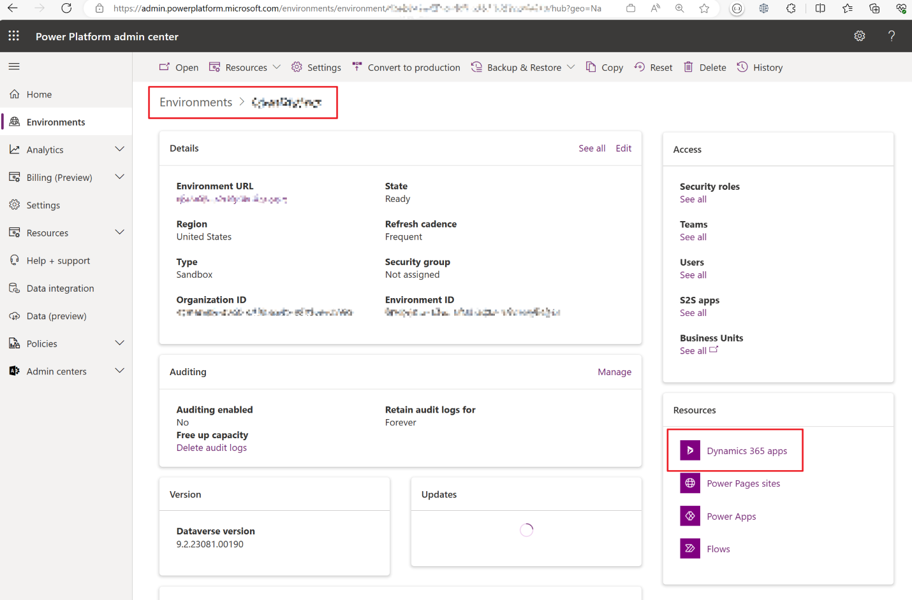

# Installation issue

This page will provide the guide to fix the known issues when you install Inventory visibility add-in.

## Error has occurred during installation

### <a name="failed-to-create-entity"></a> Failed to create entity with logical name

**Error massage example：**

Inventory visibility add in install problem error message: error has occurred during installation. Correlation id is xxxxxxxxx. Error is Cds package installation failed: Status=Failed, ErrorMessage=Failed to create entity with logical name is_allocation and object type code 11070.

**Solution：**

1. Cancel the Inventory visibility add-in installation process from the Lifecycle Services page.
1. Download the ```IV.Based_managed.zip``` from this section.
1. Sign in to the [Power Apps Home Page](https://make.powerapps.com) using the relevant user account. Then import the ```IV.Based_managed.zip``` solution by doing the following steps:

    1. Select the environment where you want to install the add-in from the right top corner.
    1. Select the **Solutions** section from the left navigation bar.
    1. Select the **Import Solution** action from the top action list.
    

1. After the IV base solution has imported successfully, sign in to the [Microsoft 365 admin center](https://admin.microsoft.com) and make sure that the user account you want to use to install the add-in has the "Dynamics 365 Unified Operations Plan" license assigned to it. Assign the license if needed.
1. Sign in to the [Power Platform admin center](https://admin.powerplatform.microsoft.com) using the relevant user account.

    - Then install the inventory visibility add-in by doing the following steps:
        1. Select the environment where you want to install the add-in.
        1. Select **Dynamics 365 Apps**
        1. Select **Install App**.
        1. Select **Inventory Visibility**
        

    - Or update the inventory visibility add-in by doing the following steps:
        1. Select the environment where you want to install the add-in.
        1. Select **Dynamics 365 Apps**
        1. Select **Inventory Visibility**
        1. Sleect **Update Available**
        

1. After the installation is completed, go back to the [Lifecycle Services](https://lcs.dynamics.com/Logon/Index) page and try again to reinstall the **Inventory Visibility** add-in.

### A managed solution cannot overwrite the EntityKeyAttribute component with Id

**Error massage example：**

A managed solution cannot overwrite the EntityKeyAttribute component with Id=xxxxxxxx which has an unmanaged base instance. The most likely scenario for this error is that an unmanaged solution has installed a new unmanaged EntityKeyAttribute component on the target system, and now a managed solution from the same publisher is trying to install that same EntityKeyAttribute component as managed. This will cause an invalid layering of solutions on the target system and is not allowed.

**Solution：**

The same solution with the previous error, see in [Failed to create entity with logical name](#failed-to-create-entity).

### <a name="AADobjectID-is-not-present"></a>AADobjectID is not present in the target CDS instance

**Error massage example：**

This will occur if the AADobjectID xxxxxxx is not present in the target CDS instance.

**Solution：**

1. Cancel the Inventory visibility add-in installation process from the Lifecycle Services page.
1. Sign in to the [Microsoft 365 admin center](https://admin.microsoft.com) and make sure that the user account you want to use to install the add-in has the "Dynamics 365 Unified Operations Plan" license assigned to it. Assign the license if needed.  
1. Sign in to the [Power Platform admin center](https://admin.powerplatform.microsoft.com) using the relevant user account.

    - Then install the inventory visibility add-in by doing the following steps:
        1. Select the environment where you want to install the add-in.
        1. Select **Dynamics 365 Apps**
        1. Select **Install App**.
        1. Select **Inventory Visibility**

    - Or update the inventory visibility add-in by doing the following steps:
        1. Select the environment where you want to install the add-in.
        1. Select **Dynamics 365 Apps**
        1. Select **Inventory Visibility**
        1. Sleect **Update Available**

1. After the installation is completed, go back to the [Lifecycle Services](https://lcs.dynamics.com/Logon/Index) page and try again to reinstall the **Inventory Visibility** add-in.

## Stuck in installing status for more than one hour

If the system warns you that you don't have permission to install Inventory Visibility on Lifecycle Services, you must contact the administrator to modify your permission.
If it takes more than an hour to install from the Lifecycle Services page, then your user account probably lacks permission to install solutions in the Dataverse environment.

**Solution：**

The same solution with the previous error, see in [AADobjectID is not present in the target CDS instance](#AADobjectID-is-not-present).
