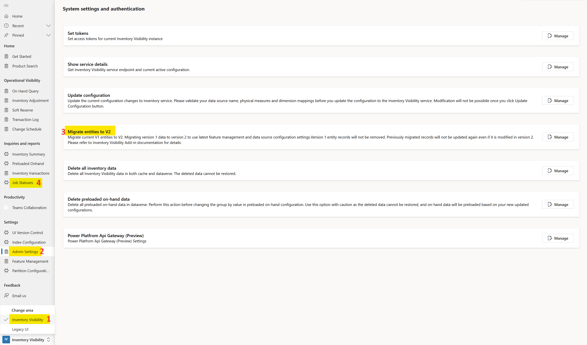
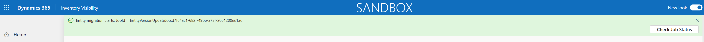
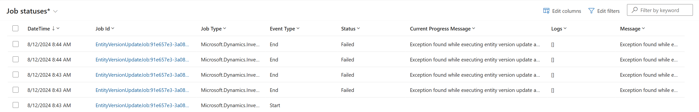

# Migrate Configuration Settings from UI Version 1 to UI Version 2

This is a supplementary operating guide for [Migrate configuration settings from UI version 1 to UI version 2](https://learn.microsoft.com/dynamics365/supply-chain/inventory/inventory-visibility-ui-version-2#migrate-configuration-settings-from-ui-version-1-to-ui-version-2). For more details about UI version 1 and UI version 2 in Inventory Visibility app, please refer to [Inventory Visibility app user interface version](https://learn.microsoft.com/dynamics365/supply-chain/inventory/inventory-visibility-ui-version-2).

> [!IMPORTANT] 
> The recommended IV solution version is 1.2.3.101 or newer, which provides user-friendly interface. ([How to update IV solution version](https://learn.microsoft.com/dynamics365/supply-chain/inventory/inventory-visibility-setup#update-add-in))

1. Go to IV Power App, navigate to UI version 2 by selecting Inventory Visibility in the bottom left corner.

2. Select Admin Settings -> Migrate entities to V2. Migration is done by a background job. If a green message pops out on top, it means the job is successfully created and will be scheduled for execution. The message may differ in an elder version of solution, which is rewritten to avoid confusion.

3. Click Check Job Status in the message or click Job Statuses in the left panel to see job execution details. Identify the job with the unique Job Id beginning with `EntityVersionUpdateJob`.
    - If the job finishes successfully, a record with `Completed` Status and `Job Completed` Message will be inserted.
    
    - If the job fails, it will be retried. The maximum retry count is 3, so if all retries fail, 4 recrods with `Failed` Status will be inserted. Please refer to the Message field for failure details.
    

## Troubleshooting

> [!NOTE] 
> **For further support, please contact us via InventVisibilitySupp@microsoft.com.**

### What is the relationship between UI version and entity version?

Most UIs in IV Power App have corresponding Dataverse entities. Generally speaking, UI version 1 uses entity version 1 and UI version 2 uses entity version 2. Only a few entities are shared between 2 UI versions.

### The value of Entity Version column in UI Version Control is 2. Does this mean migration is finished and active runtime configuration is using entity version 2?

No. Migration job will update the value of Entity Version column to 2 at the very beginning. Please confirm execution status of migration job through Job Statuses. Also, please note that update configuration is part of migration job. After it finishes, you should find `{"EntityVersion": 2}` in your [runtime configuration](https://learn.microsoft.com/dynamics365/supply-chain/inventory/inventory-visibility-power-platform#endpoint).

### I didn't see records with End Event Type in Job Statuses.

Please wait a while for the job to execute and try refresh the page. If the issue persist, please try [obtain job execution progress using API](https://learn.microsoft.com/dynamics365/supply-chain/inventory/inventory-visibility-api#get-job-execution-progress).