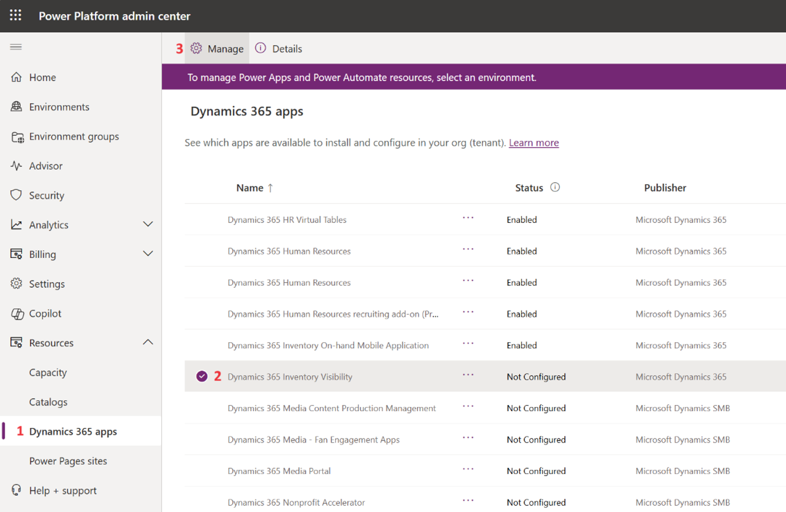
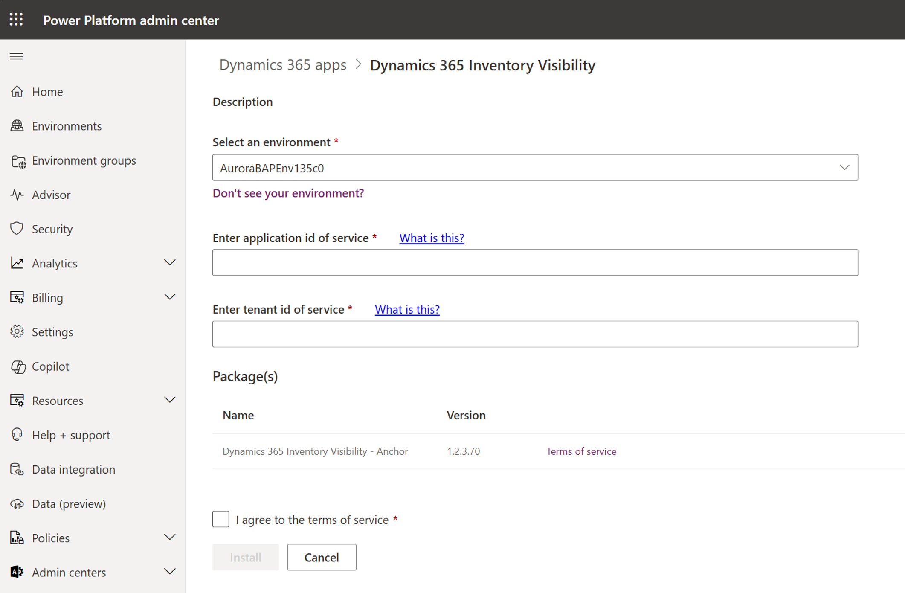

# Reinstall IV from PPAC

Although app uninstallation from Power Platform admin center is not supported, there is a workaround to re-trigger the process of app installation (and registration as part of installtion).

1. Sign in to your Azure portal.
    - If you have already installed IV on this environment before, find that app registration for IV on this environment. Check the client secret and if expired, [add a new client secret](https://learn.microsoft.com/entra/identity-platform/how-to-add-credentials?tabs=certificate).
    - If you can't find or don't have the app registration for IV on this environment, [register an new application](https://learn.microsoft.com/entra/identity-platform/quickstart-register-app) and [add a new client secret](https://learn.microsoft.com/entra/identity-platform/how-to-add-credentials?tabs=certificate) to Microsoft Entra under your Azure subscription.

> [!IMPORTANT]
> Each environment should have its own app registration and cannot share with another environment. Otherwise, you'll see [401 unauthorized errors](401%20unauthorized%20invalid%20token%20issue.md).

2. Make a note of the **Application (Client) ID**, **Client Secret**, and **Tenant Id** values.

3. Go to Power Platform admin center.

4. On the left panel, select Resources -> Dynamics 365 apps. Find Dynamics 365 Inventory Visibility in the app list and click Manage.

> [!CAUTION]
> **DO NOT** enter the your environment details page to select Dynamics 365 apps resources. Enter through Resources on the left panel.

5. Select the target environment. Enter the application Id and tenant Id that are registered from Azure portal (step 1). Agree to the terms of service and click Install.

6. During installation, the status of IV add-in is shown as Installing. After installation completes, the status will change to Installed.
