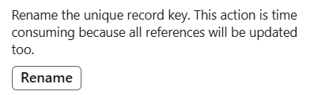

# Rename the Unique Record Key in FNO

Renaming the unique record key is supported in FNO. However, if the key is inventory-related, the rename operation would lead to an inventory change that cannot be captured by IV. 

## Issue Description

After the rename operation, corresponding inventory with new key value is not synced to IV, until the inventory is udpated in standard ways. Inventory with old key value no longer exists in FNO but remains in IV.

## Root Cause

The rename operation is more like a direct SQL DB update rather than a standard inventory update. Hence, IV related logic will not be triggered, and IV will not be notified of this replacement.

After the rename operation, if any standard inventory update is performed on inventory with new key value in FNO, IV batch job is able to capture the change and sync the "new" inventory to IV.

Inventory with new key value is completely different inventory from that with old key value. Since all inventory with old key value disappears in FNO, "old" inventory in IV can no longer be touched and updated.

## Workaround

A resync operation is required to enforce alignment between FNO and IV.

1. Go to Inventory management -> Setup -> Inventory Visibility integration parameters. Enable Resync before initial push and save.

2. Go to Inventory management -> Periodic tasks -> Inventory Visibility integration, disable the job and then re-enable it. FnO data is synced to IV as the record count decreases.

> [!NOTE] 
> Resync operation will first remove all inventory under fno datasource in IV, and initial push operation will then sync all FNO inventory to IV. During the process, the usage of FNO will not be affected, but for the usage of IV, it is possible that some inventory is removed in IV by resync operation and not yet synced to IV by initial push operation. Therefore, querying inventory in IV may have incomplete results before initial push finishes.

