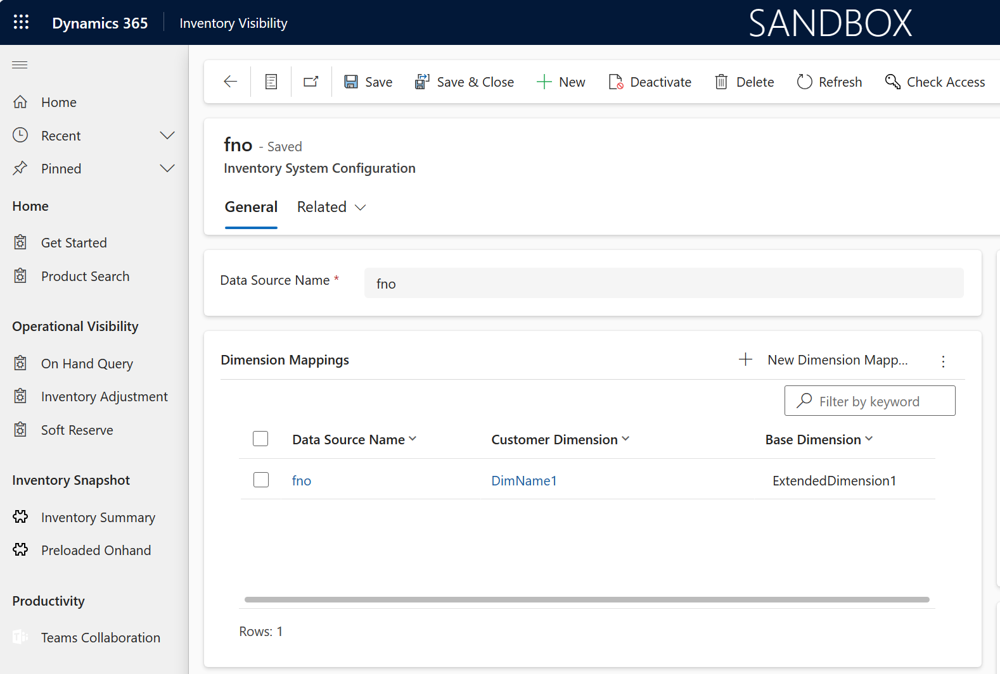

# Adding custom fields to Inventory Visibility Add-in 

## Introduction

This is about adding custom fields to Inventory Visibility add-in. 

Usage example: A user may want to add customized query patterns to Inventory Visibility Add-in, e.g., a `Yes/No` value associated with each Item ID. This can be done by adding the value as a custom `Dimension` value by writing X++ extensions, and corresponding configurations in Inventory Visibility side.

The field value is required to be unique to each unique `InventSum` record. At most eight (8) different customized fields are supported. 

## Writing extensions

The extension is about adding a custom dimension value when data contract is assembled in Dynamics 365 SCM to be sent to Inventory Visibility. It requires two steps: First to add a field to data contract class `InventOnHandChangeEventDimensionSet`, then to assign the dimensions the value you want. 


If your item is potentially advanced warehouse management (WMS) enabled, the customization is needed for `InventInventoryDataServiceBatchJobTask.transformWHSInventReserve()` method as well. 

### Adding new dimension value to your contract 

Write an extension to assign a value to a new dimension field called `extendedDimension1`. 

```
[ExtensionOf(classStr(InventOnHandChangeEventDimensionSet))]
final class InventOnHandChangeEventDimensionSet_IVExt_Extension
{
    private str extendedDimension1;

    [DataMember('ExtendedDimension1')]
    public str parmExtendedDimension1(str _extendedDimension1 = extendedDimension1)
    {
        extendedDimension1 = _extendedDimension1;
        return extendedDimension1;
    }
}
```

This part of extension should look similar to each user -- the only difference made is the field name. In our example it will add a new "ExtendedDimension1" to the dimensions part in the data contract sent from Dynamics 365 SCM to Inventory Visibility. 

The field name is used in later IV queries. If you decide to use field names other than `ExtendedDimensions1~8`, we'll go through configuration parts later. 

### Assigning values to customized fields.  

The actual dimension values should be assigned in `transformInventSum()` method, so an extension is needed on the method. We show an example for assigning a fixed value to every request. You may add more detailed logics based on actual needs. 

```
[ExtensionOf(classStr(InventInventoryDataServiceBatchJobTask))]
final class InventInventoryDataServiceBatchJobTask_IVExt_Extension
{
    public InventOnHandChangeEvent transformInventSum(InventSum inventSum, RecId inventSumQueueRecId, List reserveOffsetList)
    {
        InventOnHandChangeEvent builtInChangeEvent = next transformInventSum(inventSum, inventSumQueueRecId, reserveOffsetList);
        var dimensionSet = builtInChangeEvent.parmDimensionSet();

        dimensionSet.parmExtendedDimension1("extValue");
        builtInChangeEvent.parmDimensionSet(dimensionSet);

        return builtInChangeEvent;
    }

}
```

## Configuring Inventory Visibility Add-in

The field name is used in later IV queries. If you decide to use field names other than `ExtendedDimensions1~8`, extra configuration is needed in Inventory Visibility add-in. 

A configuration is needed to map the customized dimension field name, if being different, to ExtendedDimensions1~8. In power apps UI, go to `feature management` -> `Data source settings` -> `Manage`, in dimension mappings area, add new dimension record to set `Customer Dimension` to the actual field name in extension code, and base dimension value as one of `ExtendedDimension1~8`



The query pattern will look like this for an `IndexQuery`: 

```JSON
{
    "filters": {
        "OrganizationId": [
            "usmf",
        ],
        "productId": [
            "tshirt"
        ],
        "ExtendedDimension1": [
            "SomeValue"
        ]
    },
    "groupByValues": ["siteId", "LocationId", "ExtendedDimension1"],
    "returnNegative": true,
}

```

## Testing the extensions

As Inventory Visibility is only available on Tier-2+ environments, a developer need to deploy the code to sandbox and test the integrations. 

## Pros and Cons

This is a straightforward approach not taking much dev efforts. But notice that this adds a dimension value to each inventory record, hence adding Data verse storage loads. 

Before deploying the change, user is required to clean all existing data and start the initial sync process from Dynamics 365 SCM over again. 

## Finding extension examples. 

You can find a sample code for X++ extension in `IV_Ext_example.axpp` in current folder. 

